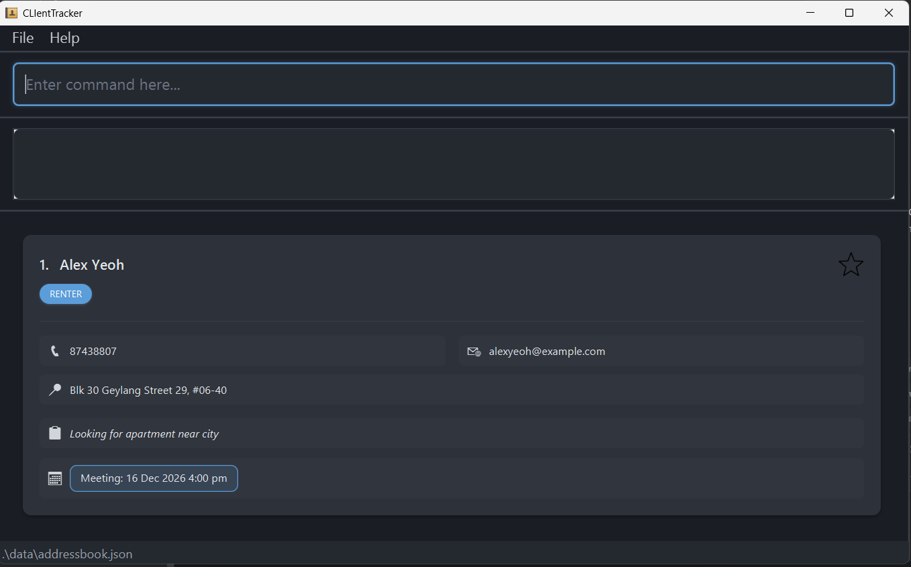

**ClientTracker is a desktop CRM for property agents.** It helps agents manage clients, meetings, notes, and listings quickly through a Command Line Interface (CLI), while still keeping a clean visual desktop interface.

ClientTracker is designed for fast day-to-day workflows such as adding clients, finding contact details, scheduling meetings, and updating records without depending on an internet connection.

* If you want to start using ClientTracker, head over to the dedicated [**User Guide**](UserGuide.html).
* If you want the setup steps first, visit the [**Quick Start**](UserGuide.html#quick-start).
* If you are working on the product itself, the [**Developer Guide**](DeveloperGuide.html) is the best place to begin.

**Acknowledgements**

* Libraries used: [JavaFX](https://openjfx.io/), [Jackson](https://github.com/FasterXML/jackson), [JUnit5](https://github.com/junit-team/junit5)
